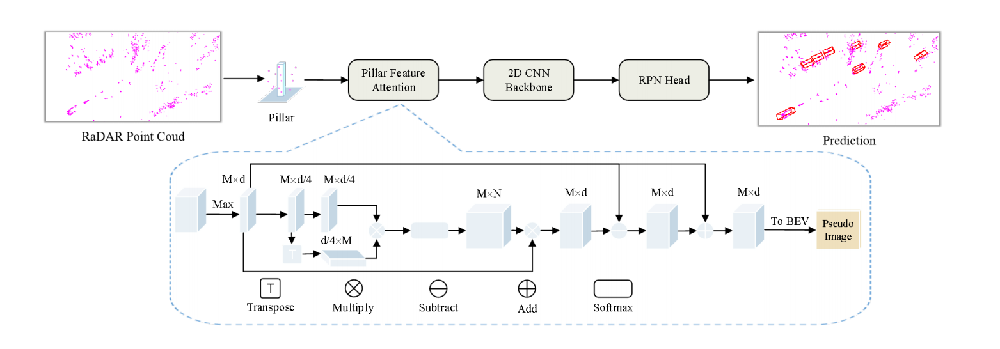
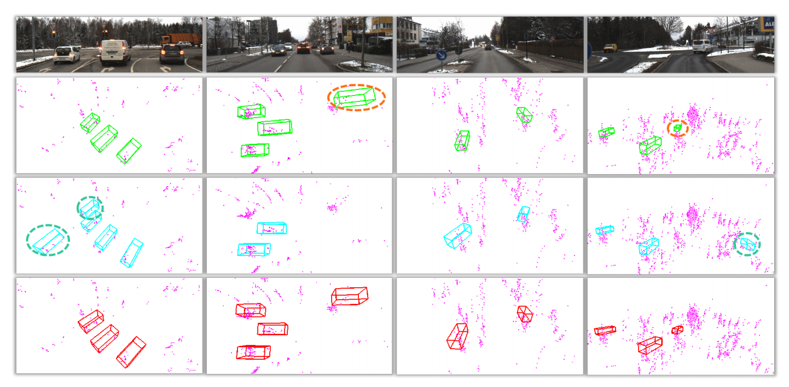
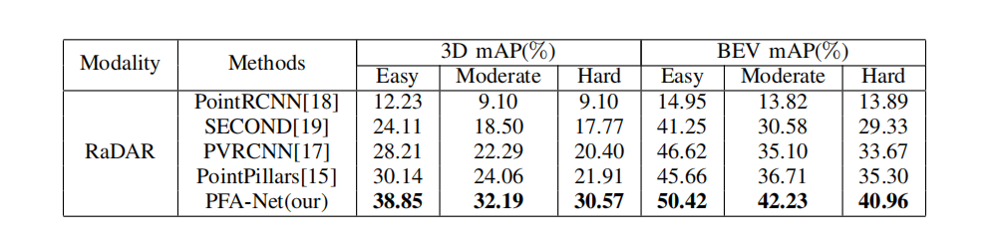

# PFA-NET

The code is mainly based on [OpenPCDet](https://github.com/open-mmlab/OpenPCDet).

## 项目用途
3D object detection is a crucial problem in environmental perception for autonomous driving. Currently,
most works focused on LiDAR, camera, or their fusion, while
very few algorithms involve a RaDAR sensor, especially 4D
RaDAR providing 3D position and velocity information. 4D
RaDAR can work well in bad weather and has a higher
performance than traditional 3D RaDAR, but it also contains
lots of noise information and suffers measurement ambiguities.
Existing 3D object detection methods can’t judge the heading
of objects by focusing on local features in sparse point clouds.
To better overcome this problem, we propose a new method
named PFA-Net only using a 4D RaDAR, which utilizes a
Self-Attention mechanism instead of PointNet to extract point
clouds’ global features. These global features containing long distance information can effectively improve the network’s
ability to regress the heading angle of objects and enhance
detection accuracy. Our method’s performance is enhanced
by 8.13% of 3D mAP and 5.52% of BEV mAP compared
with the baseline. Extensive experiments show that PFA-Net
surpasses state-of-the-art 3D detection methods on Astyx HiRes
2019 dataset 
* Model Framework:
<p align="center">
  
</p>

## 项目数据集
### 项目数据集简介

 Astyx HiRes2019数据集是一个流行的汽车雷达数据集，用于基于深度学习的3D对象检测。开源该数据集的动机是为研究社区提供高分辨率的雷达数据，
 促进和激励使用雷达传感器数据的算法的研究。该数据集是以雷达为中心的自动数据集，基于雷达、激光雷达和摄像机数据，用于三维目标检测。
 数据集的大小超过350 MB，由546帧组成，包含大约3000个非常精确标记的三维对象注释。虽然大多数对象属于“汽车”类，但也提供了总共7个类别（公共汽车、汽车、自行车手、摩托车手、人、拖车、卡车）的少量地面真实数据。
<p align="center">
  
</p>

### 项目数据集地址
`/home/datasets_user/astyx`

### 项目中数据集地址的引用

tools\cfgs\dataset_configs\astyx_dataset.yaml line 2,12,26

tools\cfgs\astyx_models\pointpillar.yaml line 30


## 安装信息
### 环境
- Python 3.8
- PyTorch '1.10.2+cu113'
- CUDA 11.3
- GCC 7.5
- pcdet '0.5.2+8c6e889'

### 安装步骤

a. Clone this repository.
```shell
git clone https://github.com/adept-thu/InterFusion.git
```

b. Install the dependent libraries as follows:

* Install the dependent python libraries: 
```
pip install -r requirements.txt 
```
c. Generate dataloader
```
python -m pcdet.datasets.astyx.astyx_dataset create_astyx_infos tools/cfgs/dataset_configs/astyx_dataset_radar.yaml
```

## Training
```
CUDA_VISIBLE_DEVICES=1 python train.py --cfg_file cfgs/astyx_models/pointpillar.yaml --tcp_port 25851 --extra_tag yourmodelname
```

## Testing
```
python test.py --cfg_file cfgs/astyx_models/pointpillar.yaml --batch_size 4 --ckpt ##astyx_models/pointpillar/debug/ckpt/checkpoint_epoch_80.pth
```
## 核心文件简介

```
├─data
│  └─kitti
│      └─ImageSets
├─docker
├─docs
├─pcdet
│  ├─datasets
│  │  ├─astyx
│  │  ├─augmentor
│  │  ├─kitti
│  │  │  └─kitti_object_eval_python
│  │  ├─nuscenes
│  │  └─processor
│  ├─models
│  │  ├─backbones_2d
│  │  │  └─map_to_bev
│  │  ├─backbones_3d
│  │  │  ├─pfe
│  │  │  └─vfe
│  │  ├─dense_heads
│  │  │  └─target_assigner
│  │  ├─detectors
│  │  ├─model_utils
│  │  └─roi_heads
│  │      └─target_assigner
│  ├─ops
│  │  ├─iou3d_nms
│  │  │  └─src
│  │  ├─pointnet2
│  │  │  ├─pointnet2_batch
│  │  │  │  └─src
│  │  │  └─pointnet2_stack
│  │  │      └─src
│  │  ├─roiaware_pool3d
│  │  │  └─src
│  │  └─roipoint_pool3d
│  │      └─src
│  └─utils
└─tools
    ├─cfgs
    │  ├─astyx_models
    │  ├─dataset_configs
    │  ├─kitti_models
    │  └─nuscenes_models
    ├─eval_utils
    ├─scripts
    ├─train_utils
    │  └─optimization
    └─visual_utils
```


## 训练测试

### 训练

```shell
cd tools/
```
```
CUDA_VISIBLE_DEVICES=1 python train.py --cfg_file cfgs/astyx_models/pointpillar.yaml --tcp_port 25851 --extra_tag yourmodelname
```

### 测试

```shell
cd tools/
```
```
python test.py --cfg_file cfgs/astyx_models/pointpillar.yaml --batch_size 4 --ckpt ##astyx_models/pointpillar/debug/ckpt/checkpoint_epoch_80.pth
```

## 可视化
<p align="center">
  
</p>


## 实验效果
* All experiments are tested on Astyx Hires2019
<p align="center">
  
</p>


## 目前成果 
-- 后续补充
| Dataset | benchmark | Params(M) | FLOPs(M) |               Download               |      Config      |
|:-------:|:---------:|:---------:|:--------:|:------------------------------------:|:----------------:|
|  KITTI  |           |           |          | [model](https:) &#124; [log](https:) | [config](https:) |
|         |           |           |          | [model](https:) &#124; [log](https:) | [config](https:) |

## 注意事项 


##引用

##作者联系方式（qq微信）
